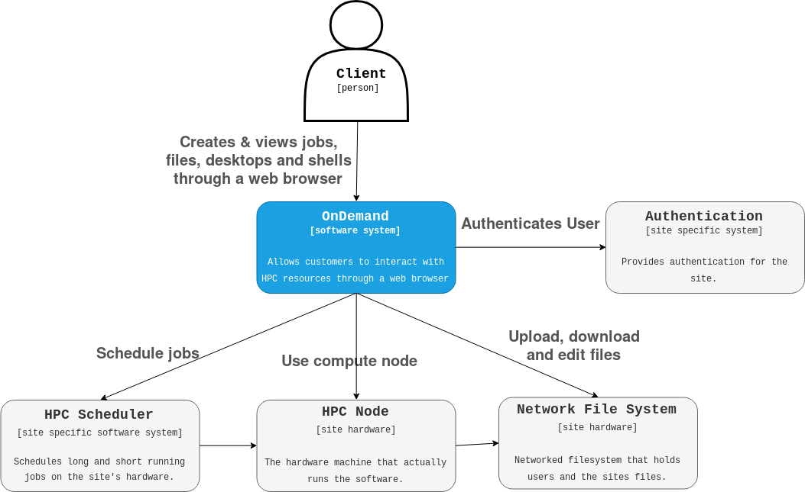

% Open OnDemand Lawrencium HPC Training 
% March 10, 2021
% Wei Feinstein

# Introduction

Slides and sample codes can be found on github [https://github.com/lbnl-science-it/Training-OpenOnDemand](https://github.com/lbnl-science-it/Training-OpenOnDemand)

Video will be posted

There will be a hands-on session at the end of this training

Send your questions to chatroom

Fill out [training survey](https://docs.google.com/forms/d/e/1FAIpQLSd2NifASkyCCQxAkClkEY0OrBaU72__VqXFeaL0Ys_wwrATIw/viewform)
 

# Outline

- What is Open OnDemand on Lawrencium
- How to access OOD  
- Features
   - File management
   - Cluster shell access
   - Job submission and monitoring
   - Interactive apps
- Hands-on exercises


# What is Lawrencium Open OnDemand

- Lawrencium OOD portal is based on an open source web platform [https://openondemand.org/](https://openondemand.org/)
- The project is designed by Ohio Supercomputer Center
- Users can access HPC cluster resources and services via a web browser 
- Provide an intuitive interface and allows new users to be instantly productive at using the HPC resources for their research
- An alternative convenient way for experienced users to access the HPC resources. 
- Flexible and extensible design that makes it easy to deploy new services as needed.


# OOD at the System Level

<left></left>


# Services Provided

- Easy file transfer and management
- Command-line shell access
- Job submission and monitoring
- Interactive apps, graphic desktop environment
   - Juyter Notebook
   - RStudio
   - MatLab
   - VMD
- More apps will be added 
  

# How to Access

[https://lrc-ondemand.lbl.gov/](https://lrc-ondemand.lbl.gov/)

### Authetication 

<left></left>

- Username: Lawrencium username
- Password: pin + OTP


# Dashboard

<left></left>


# Files
<left></left>
<left></left>

# File/Directory Management

- Conventional command-line approach 
   - Linux file editing, vi, nano, emacs
   - File transfer: rsync, scp
   - Globus still an option of file transfer

- New avenue to manage files/dirs
   - Viewing files
   - Text editing
   - Copy/Paste
   - Renaming files
   - Creating files
   - Creating directories
   - Deleting files
   - File upload/download


# Cluster Shell Access
  
Provide the conventional cluster access: command-line/terminal

<left></left>
<left></left>
 

# Job Management

Job monitoring, composing and submission  

<left></left>
<left></left>


# Job Composer

- From templates
- From specific path
- From selected job

<left></left>


# Job Templates

- Provided by system admins
- Defined by users

<left></left>

# Job Submission Script 

<left></left>
<right></right>

# Job Submission Directory

- Two ways to cope with the default directory created by the job composer.
   - The default directory as the working directory of your job. 
   - `/global/home/users/wfeinstein/ondemand/data/sys/myjobs/projects/default`
   - You need to upload all input files to that directory before you can click the submit button. 
   - This can be done by clicking 'Open Dir' right beneath the job script contents. 
   - A file explorer will open the job directory in a new tab where you can do file transfers.
   
   - Have the input files stored somewhere in the cluster and don't want to move them around
   - Prefer to have an organized directories by yourself, such as home or scratch...
   - Add one command line in your job script
   - `cd /path/to/job_working_dir`


# Interactive Apps

<left></left>
<left></left>


# Jupyter Notebook App

- Three types of use:
   - Interactive-mode, for exploration 
   - Interactive-mode-gpu, for exploration 
   - Compute mode: standarded Lawrencium partitions (e.g.: lr5,lr6,es1...)

<left></left>


# Slurm Account, Partition, QOS from an Access Shell
 
```
sacctmgr show association user=wfeinstein -p

Cluster|Account|User|Partition|Share|Priority|GrpJobs|GrpTRES|GrpSubmit|GrpWall|GrpTRESMins|MaxJobs|MaxTRES|MaxTRESPerNode|MaxSubmit|MaxWall|MaxTRESMins|QOS|Def QOS|GrpTRESRunMins|
perceus-00|pc_scs|wfeinstein|lr6|1||||||||||||lr_debug,lr_lowprio,lr_normal|||
perceus-00|ac_test|wfeinstein|lr5|1||||||||||||lr_debug,lr_lowprio,lr_normal|||
perceus-00|pc_test|wfeinstein|lr4|1||||||||||||lr_debug,lr_lowprio,lr_normal|||
perceus-00|pc_test|wfeinstein|lr_bigmem|1||||||||||||lr_debug,lr_lowprio,lr_normal|||
perceus-00|lr_test|wfeinstein|lr3|1||||||||||||condo_test|||
perceus-00|scs|wfeinstein|es1|1||||||||||||es_debug,es_lowprio,es_normal|||
...
```

# Jupyter Notebook  

<left></left>


# Matlab App

- Enabled on GPU and CPU nodes

<left></left>


# Matlab App Launch

<left></left>


# Matlab App GUI

<left></left>


# VMD App (Visual Molecular Dynamics)

A molecular visualization program for displaying, animating, and analyzing large biomolecular systems using 3-D graphics and built-in scripting.

<left></left>


# VMD Example

<left></left>


# RStudio App

<left></left>

# RStudio GUI

<left></left>


# Log out and Cleanup

- Log out the portal properly
   - Clicking 'Log out' from the top navigation bar; 

- Cleanup
   - The portal stores temporary files for interactive apps in $HOME/ondemand/data/sys/dashboard/. 
   - It is a good habit to clean this directory periodically.
   - 
   `rm -rf $HOME/ondemand/data/sys/dashboard/batch_connect/sys/*`


# Getting help

- Virtual Office Hours:
    - Time: 10:30am - noon (Wednesdays)
    - Online [request](https://docs.google.com/forms/d/e/1FAIpQLScBbNcr0CbhWs8oyrQ0pKLmLObQMFmYseHtrvyLfOAoIInyVA/viewform)
- Sending us tickets at hpcshelp@lbl.gov
- More information, documents, tips of how to use LBNL Supercluster [http://scs.lbl.gov/](http://scs.lbl.gov)

To improve our HPC training and services, please fill out [Training Survey](https://docs.google.com/forms/d/e/1FAIpQLSd2NifASkyCCQxAkClkEY0OrBaU72__VqXFeaL0Ys_wwrATIw/viewform)


# Hands-on Exercise

Open Ondemand Navigation

[https://lrc-ondemand.lbl.gov/](https://lrc-ondemand.lbl.gov/)  

